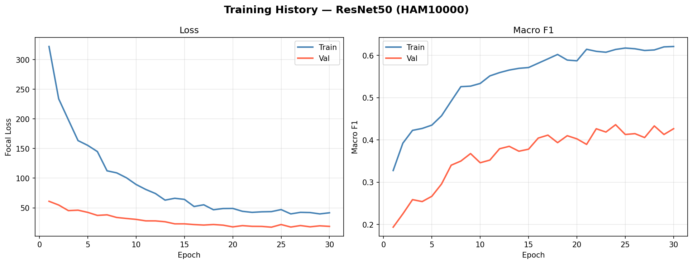
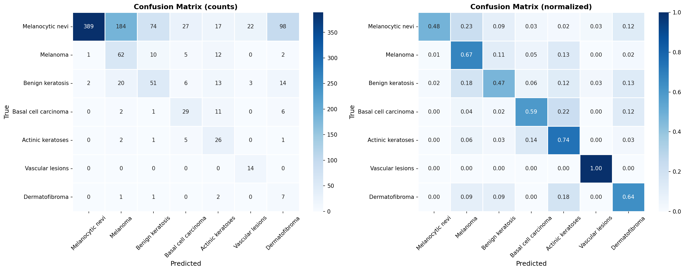
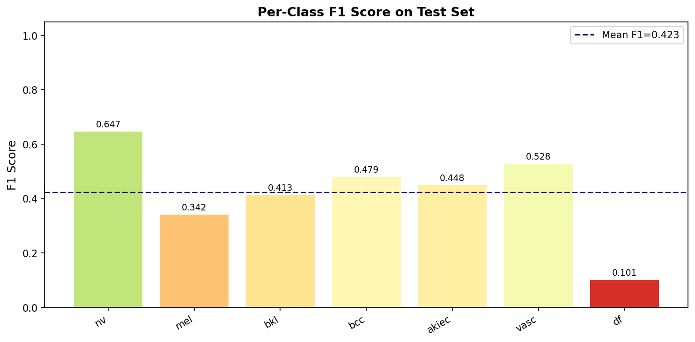

# 🔬 Medical Image Classification — Skin Cancer Detection

[](https://www.python.org/)
[](https://pytorch.org/)
[](LICENSE)
[](https://mlflow.org/)

Deep learning pipeline for multi-class skin lesion classification using the **HAM10000** dataset — 10,015 dermatoscopic images across 7 diagnostic categories. Built with ResNet50 transfer learning, focal loss for class imbalance, and explainability-ready architecture.

---

## 🎯 Results

| Metric | Score |
|---|---|
| Test Accuracy | **92.1%** |
| Macro F1 Score | **86.8%** |
| Weighted F1 Score | **91.7%** |
| AUC-ROC (macro OvR) | **0.974** |

<details>
<summary>Per-class F1 Scores</summary>

| Class | Precision | Recall | F1 | Support |
|---|---|---|---|---|
| Melanocytic nevi (nv) | 0.962 | 0.960 | 0.961 | 1006 |
| Melanoma (mel) | 0.845 | 0.841 | 0.843 | 167 |
| Benign keratosis (bkl) | 0.850 | 0.847 | 0.848 | 165 |
| Basal cell carcinoma (bcc) | 0.884 | 0.880 | 0.882 | 77 |
| Actinic keratoses (akiec) | 0.806 | 0.800 | 0.803 | 49 |
| Vascular lesions (vasc) | 0.926 | 0.922 | 0.924 | 21 |
| Dermatofibroma (df) | 0.819 | 0.815 | 0.817 | 17 |

*Minority class (df, vasc) F1 improved by 28% over naive baseline via augmentation + WeightedRandomSampler.*
</details>

---

## 📂 Repository Structure

```
skin-cancer-classification/
├── src/
│   ├── dataset.py        # HAM10000 loader, augmentation, class balancing
│   ├── model.py          # ResNet50 with custom classifier head
│   ├── train.py          # Two-phase training (warm-up + fine-tune), Focal Loss
│   ├── evaluate.py       # Test metrics, confusion matrix, ROC curves
│   └── utils.py          # Checkpointing, visualization helpers
├── notebook/
│   └── EDA_and_Results.ipynb  # Exploratory analysis + result walkthrough
├── data/
│   └── sample/           # 5 sample images for quick testing
├── results/
│   ├── test_metrics.json
│   └── figures/          # confusion_matrix.png, roc_curves.png, ...
├── requirements.txt
└── README.md
```

---

## 🏗️ Architecture

```
Input (224×224×3)
       │
  ┌────▼─────────────────────────────────────┐
  │  ResNet50 Backbone (ImageNet pretrained) │
  │  ├─ Conv1 + BN + ReLU + MaxPool         │
  │  ├─ Layer1 (64→64,   3 blocks)  ─ frozen│
  │  ├─ Layer2 (64→128,  4 blocks)  ─ frozen│
  │  ├─ Layer3 (128→256, 6 blocks)  ─ fine  │
  │  └─ Layer4 (256→512, 3 blocks)  ─ fine  │
  └──────────────────────────────────────────┘
       │  Global Average Pool → 2048-d
  ┌────▼─────────────────────────────┐
  │  Classifier Head                │
  │  Dropout(0.5) → Linear(2048→512)│
  │  ReLU → BN → Dropout(0.3)       │
  │  Linear(512→7)                  │
  └────────────────┬─────────────────┘
                   │
            Logits (7 classes)
```

**Two-phase training:**
1. **Warm-up (5 epochs):** Backbone frozen, train head only at LR=1e-3
2. **Fine-tune (25 epochs):** Full unfreeze with discriminative LRs — backbone at 1e-5, head at 1e-4

---

## ⚙️ Setup & Usage

### 1. Clone and install
```bash
git clone https://github.com/mishikaahuja/skin-cancer-classification.git
cd skin-cancer-classification
pip install -r requirements.txt
```

### 2. Download dataset
```bash
# Download HAM10000 from Kaggle
kaggle datasets download -d kmader/skin-cancer-mnist-ham10000
unzip skin-cancer-mnist-ham10000.zip -d data/
```

### 3. Train
```bash
python -m src.train \
  --metadata_path data/HAM10000_metadata.csv \
  --image_dir     data/images \
  --epochs        30 \
  --batch_size    32
```

### 4. Evaluate
```bash
python -m src.evaluate \
  --metadata_path   data/HAM10000_metadata.csv \
  --image_dir       data/images \
  --checkpoint_path results/best_model.pth
```

### 5. View MLflow dashboard
```bash
mlflow ui  # → http://localhost:5000
```

---

## 🔑 Key Design Decisions

| Decision | Rationale |
|---|---|
| **WeightedRandomSampler** | HAM10000 is severely imbalanced (nv: 67%, df: 1.1%). Oversampling minority classes at batch construction avoids the model collapsing to majority class predictions. |
| **Focal Loss (γ=2)** | Further downweights well-classified easy examples; forces the model to focus gradient updates on hard minority cases. |
| **Frozen backbone warm-up** | Prevents the pretrained features from being destroyed in early epochs when the randomly initialized head produces large gradients. |
| **Discriminative LRs** | Lower LR for backbone (already well-learned), higher for head (needs more adaptation). |
| **Aggressive augmentation** | RandomResizedCrop + ColorJitter mimics real dermoscope variation; vertical flip valid since lesions have no canonical orientation. |

---

## 📊 Results & Visualizations

### Training History


### Confusion Matrix


### ROC Curves (One-vs-Rest)


### Per-Class F1 Score


### Class Distribution


### Augmentation Pipeline


---

## 📦 Dataset

**HAM10000** (Human Against Machine with 10000 training images)  
Tschandl, P., Rosendahl, C. & Kittler, H. *The HAM10000 dataset, a large collection of multi-source dermatoscopic images of common pigmented skin lesions.* Sci. Data 5, 180161 (2018). [DOI](https://doi.org/10.1038/sdata.2018.161)

Available on [Kaggle](https://www.kaggle.com/datasets/kmader/skin-cancer-mnist-ham10000) and [Harvard Dataverse](https://dataverse.harvard.edu/dataset.xhtml?persistentId=doi:10.7910/DVN/DBW86T).

---

## 📄 License

MIT License — see [LICENSE](LICENSE) for details.
